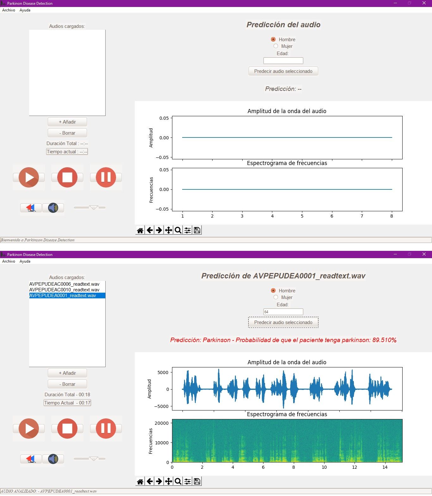

# TFG-Neurodegenerative-Disease-Detection

## Parkinson Disease Detection
Uso de biomarcadores extraídos de la voz para la detección de depresión y enfermedades neurodegenerativas (Parkinson).
Trabajo de fin de grado de Ingeniería Informática realizado en la **Universidad de Burgos**. Minería de datos aplicada a la diagnosis del Parkinson.

* Autor: *Adrián Arnaiz Rodríguez*
* Tutores: *Dr. José Francisco Diez Pastor* y *Dr. César Ignacio García Osorio*

---

## Resumen
La enfermedad del Parkinson causa, entre otras discapacidades, discapacidades en el habla a más del 90% de los pacientes. Esta enfermedad causa trastornos del habla como pueden ser volumen monótono, imprecisión en la articulación y otros síntomas. Hay numerosos estudios que abordan el problema de detección del Parkinson por voz, aunque sin llegar a desarrollar ninguna aplicación. En este estudio se aportan perspectivas diferentes para llegar a mejores resultados de precisión y, por otra parte, desarrollar una aplicación de ayuda al facultativo médico.

En esta investigación, a partir de una base de datos de audios adquirida, tratamos de realizar todo el proceso de minería de datos que nos permita llegar a construir un clasificador. Este clasificador distingue entre si la persona de un audio tiene Parkinson o no. Para ello, se abordarán diferentes tipos de características extraídas de los audios (por un lado, características físicas: frecuencia fundamental, coeficientes cepstrales de frecuencia Mel, etc. Y, por otro lado, características más novedosas: extracción con deep learning mediante la red neuronal VGGish) con las que se realizarán diferentes experimentos.

Por ello, se realizará una aplicación de ayuda al facultativo médico que, usando el clasificador desarrollado en la investigación, sea capaz de agilizar el proceso de diagnosis de la enfermedad del Parkinson, además de reducir el riesgo de fallo en la misma.

## Abstract
Parkinson's Disease causes speech impairments in more than 90% of patients, among other disabilities. This disease causes different disorders like monotonous volume, inaccuracy articulation and other symptoms. There are numerous studies that have addressed the problem of Parkinson's detection by voice, but they didn´t develop any application. This study provides different perspectives to achieve better precision results and, on the other hand, to develop an application to help the medical professionals.

In this research, with a database of acquired audios, we try to realice the whole data mining process, building a good classifier as the main achieve. This classifier distinguishes between if the person of an audio has Parkinson's or not. For this purpose, we address different experiments, which are carried out with different types of characteristics extracted from the audios (phisics characteristics on the one hand: fundamental frequency, MFCC, etc. And, on the other hand, more innovative ones: extraction with deep learning through the neural network VGGish.

Therefore, we will make an aid application addressed to medical professional who, using the classifier developed in the research, will be able to speed up the diagnosis process of Parkinson's disease, in addition to reducing the risk of failure in it.

---

## Página web
https://adrianarnaiz.github.io/TFG-Neurodegenerative-Disease-Detection/

---
## Repercusión

###  Prensa escrita

* **El Mundo** (Prensa escrita)
	* ["Inteligencia Artificial para seguir al párkinson"](https://github.com/AdrianArnaiz/TFG-Neurodegenerative-Disease-Detection/blob/master/doc/masRecursos/ElMundo-Innovadores-28-01-20-Inteligencia%20Artificial%20para%20seguir%20al%20p%C3%A1rkinson.pdf) (EL MUNDO DE CASTILLA Y LEÓN / AÑO VI / 28/01/2020 - Innovadores, página 7).
	* ["Voces que anticipan los temblores"](https://github.com/AdrianArnaiz/TFG-Neurodegenerative-Disease-Detection/blob/master/doc/masRecursos/ElMundo-Innovadores-17-12-19-Voces%20que%20anticipan%20temblores.pdf) (EL MUNDO DE CASTILLA Y LEÓN / AÑO VI / 17/12/2019 - Innovadores, página 6).

### Digital

* **El Mundo**
	* ["Voces que anticipan los temblores", (Castilla y León, Innovadores, 17/12/19)](https://diariodevalladolid.elmundo.es/articulo/innovadores/voces-anticipan-temblores/20191217130131365000.html).

* **Telecinco**
	* ["Dos prototipos permiten utilizar la inteligencia artificial para detectar y tratar enfermedades" (28/11/2019)](https://www.telecinco.es/informativos/ciencia/prototipos-utilizar-inteligencia-artificial-detectar-tratar-enfermedades_18_2858370271.html).

* **Conferencia de Directores y Decanos de Ingeniería Informática**
	* ["Dos prototipos de la UBU utilizan la inteligencia artificial para detectar y tratar enfermedades" (02/12/2019)](https://coddii.org/dos-prototipos-de-la-ubu-utilizan-la-inteligencia-artificial-para-detectar-y-tratar-enfermedades).

* **Universidad de Burgos**
	* [Notias de prensa de la UBU (28/10/2020)](https://www.ubu.es/noticias/dos-prototipos-de-la-ubu-utilizan-la-inteligencia-artificial-para-detectar-y-tratar-enfermedades).

* **Entre Mayores**: *Periodico especializado en las personas mayores, los profesionales y las empresas del sector*
	* ["Un prototipo de la Universidad de Burgos utiliza la inteligencia artificial para detectar el Parkinson" (29/11/2019)](http://entremayores.es/spa/ccaa.asp?var2=Castilla%20y%20Le%F3n&var3=Un%20prototipo%20de%20la%20UBU%20utiliza%20la%20inteligencia%20artificial%20para%20detectar%20el%20Parkinson&nar1=3&nar2=23&nar3=41400&nar5=1).

* **Burgos Conecta**
	* ["Dos prototipos de la UBU utilizan la inteligencia artificial para detectar y tratar enfermedades" (28/10/2019)](https://www.burgosconecta.es/burgos/universidad/prototipos-utilizan-inteligencia-20191128121921-nt.html).

* **Premio Prototipo 2019-2020 OTRI**
	* [Premios OTRI 2019-2020: Prototipos Orientados al Mercado (29/10/2020)](https://www.ubu.es/noticias/la-ubu-avanza-en-innovacion).
	* [Entrega premios OTRI 2019-2020: Prototipos Orientados al Mercado (29/10/2020)](https://www.ubu.es/agenda/entrega-de-premios-y-lanzamiento-de-nuevas-convocatorias-curso-2019-2020-prototipos-orientados-al-mercado-vii-convocatoria-prueba-concepto).
	* [Vídeo entrega de premios prototipo 2019-2020 (29/10/2020)](https://youtu.be/BCKuHDKv0bw).

---

## Instalaciones
### Clonar el repositorio
* `git clone https://github.com/AdrianArnaiz/TFG-Neurodegenerative-Disease-Detection.git`
* `git submodule update --init`, si se quiere inicializar Disvoice.

### Demo
Ir al directorio `src/demo` y seguir las instrucciones indicadas en `src/demo/README.md`. Resumidas:
* Clonar este repositorio e ir al directorio `demo`.
* Descargar los pesos vggish e insertar en carpeta `prediccion`.
* Instalar los requerimientos de requeriments.txt en entorno Python 3.6.8.

### Experimentación.
Para poder experimentar con **Disvoice**:
* Primero se tiene que haber clonado el repositorio e inicializado los submódulos (indicado arriba). Realizar una de las siguientes dos opciones:
  * Ejecutar el archivo `src/Disvoice/install.py`
  * Ejecutar `pip install -r src/Disvoice/requirements.txt`

Para poder experimentar con **VGGish**:
Es necesario resolver las mismas dependencias de VGGish. Como se indica en el original (o `src/vggish/README.md`):

Realmente, para VGGish valdría con las dependencias de `src/demo/requirements.txt`. Más información adicional sobre archivos e instalación de VGGish en [VGGish](https://github.com/tensorflow/models/tree/master/research/audioset/vggish) y [VGGish2Keras](https://github.com/antoinemrcr/vggish2Keras).

## Demo

